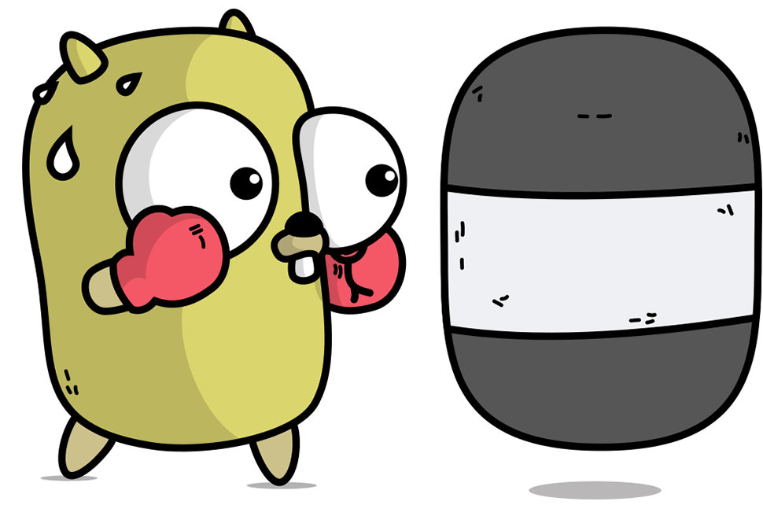

<div style="display: flex; justify-content: space-between; align-items: center; width: 50%;">
    
    
    
</div>


<h3 align="center">A passionate software developer from Thailand </h3>

<br/>

<div align="center">
 
 🔭 I’m currently working on **a senior project**
 
 🌱 I’m currently learning **Message Broker, Microservice , EDA , DDD**

 </div>
 
<div align="center"> 
  <a href="mailto:nonokub.671@gmail.com">
    
  </a>
  <a href="https://www.linkedin.com/in/thanawin-saithong-12130415a/" target="_blank">
    
  </a>
  <a href="https://Rehunt671.github.io" target="_blank">
      
  </a>
</div>

<hr/>

<h2 align="center">⚒️ Languages-Frameworks-Tools ⚒️</h2>
    <br>  
    <div align="center">
        <br/>
         
        <br>
    </div>
<hr/>
 
<div align="center">
  <h2>🐍 My Contributions 🐍</h2>
  <br>
  
</div>

<hr/>

<h2 align="center">⚡ Stats ⚡</h2>
<br>
<div align=center>
  
  
  <br/>
  
</div>
<hr/>

<h2 align="center">🏆 GitHub Trophies</h2>
<br>
<div align="center">
    <p><a href="https://github.com/ryo-ma/github-profile-trophy"></a></p>
</div>

<hr/>

<div align="center">
    <a href='https://ko-fi.com/M4M4ZX7SZ' target='_blank'>
        
    </a>&nbsp;&nbsp;
     <a href="https://buymeacoffee.com/kingsglaive" target="_blank">
        
    </a>
</div>

<hr/>

```md

```
<p align="center">
  
</p>

<br>

<hr/>

<div align="center">
  <br>
</div>

<!--Footer--> 
<p align="center">
  
</p>
